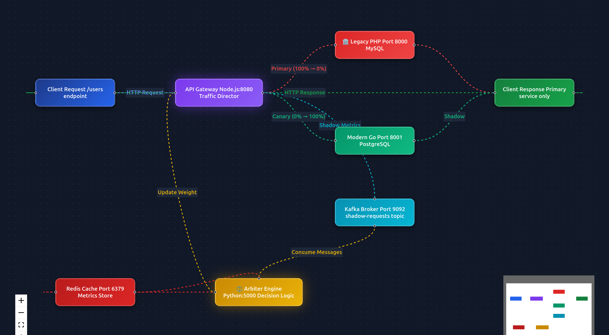
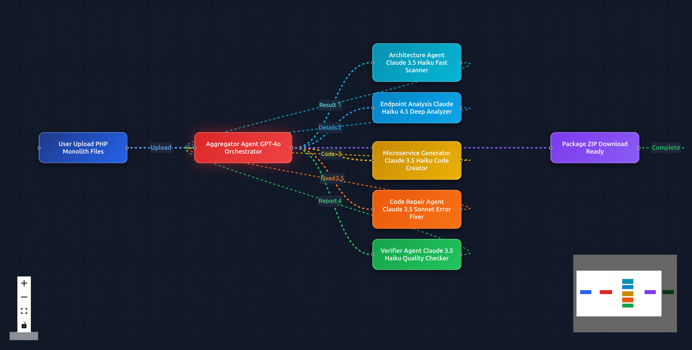

# Phoenix Engine & Agents Orchestrator: Autonomous Legacy-to-Microservices Migration Platform


## Overview

This project is a comprehensive, autonomous platform designed to transform legacy monolithic applications (specifically PHP) into modern, production-ready microservices (Go, Python, Node.js). It leverages the **Strangler Fig Pattern**, **Traffic Shadowing**, and a **Multi-Agent AI System** to ensure a safe, gradual, and verified migration process without downtime.

The system consists of two main pillars:
1.  **Phoenix Engine**: The runtime infrastructure that manages traffic routing, shadowing, consistency verification, and gradual traffic shifting.
2.  **Agents Orchestrator**: An AI-powered workflow that analyzes legacy code, generates modern microservices, and orchestrates the migration pipeline.

## Core Business Logic

The application follows a strict autonomous migration lifecycle:

1.  **Analysis & Generation**: The user uploads the legacy monolith. AI agents analyze the structure, extract business logic from specific endpoints, and generate equivalent modern microservices.
2.  **Shadow Deployment**: The new microservice is deployed alongside the legacy service.
3.  **Traffic Shadowing**: The **Gateway** routes incoming traffic to the Legacy service (primary) but asynchronously "shadows" the same request to the Modern service.
4.  **Consistency Verification**: The responses from both services are captured and sent to a **Kafka** topic. The **Arbiter** consumes these messages and compares the outputs (status codes, JSON bodies).
5.  **Gradual Cutover**: If the Modern service consistently matches the Legacy service (e.g., >99% accuracy), the Arbiter instructs the Gateway to incrementally shift real traffic to the Modern service (e.g., 0% -> 10% -> 20% ... -> 100%).
6.  **Rollback**: If consistency drops below a safety threshold, traffic is instantly rolled back to the Legacy service.

## System Architecture

### 1. Phoenix Engine (Infrastructure)



The engine provides the runtime environment for the migration, designed to mimic and handle high-throughput production environments.

*   **Real-World Traffic Simulation**:
    To validate the migration under realistic conditions, the system includes a sophisticated **Traffic Generator**. This component simulates a live legacy application environment by maintaining active client connections and generating continuous, concurrent requests. This ensures that the migration process is tested against the unpredictability and load of a real-world production system, rather than just static test cases.

*   **Smart Gateway & Canary Deployment**:
    The core routing logic is handled by a high-performance **Go-based Gateway**. This proxy is not just a load balancer; it is an intelligent traffic manager configured to execute **Canary Deployments**.
    
    For any selected endpoint, the Gateway can split traffic with granular precision. Initially, it routes 100% of traffic to the legacy app while "shadowing" requests to the new microservice for verification. Once the **Arbiter** confirms consistency, the Gateway dynamically adjusts the routing weights (e.g., shifting 10%, then 30%, then 50% of live traffic) to the new microservice. This gradual shift minimizes risk, allowing the system to instantly revert (rollback) to the legacy provider if any anomalies are detected in the live traffic stream.

*   **Arbiter (Python)**: The decision-making brain. It consumes comparison data from **Kafka**, calculates real-time consistency scores, and instructs the Gateway to promote or demote services.
*   **State Store (Redis)**: Stores dynamic configuration, such as current traffic weights and session data.
*   **Service Mesh**: A Docker network (`phoenix-network`) enabling service discovery and communication between dynamic containers.

### 2. Agents Orchestrator (AI Workflow)



A Next.js-based application that coordinates five specialized AI agents to handle the code migration. The pipeline visualized above demonstrates the "Chain of Thought" flow from raw legacy code to a verified, deployable microservice.

#### Agent Roles & Responsibilities

1.  **Architecture Agent**
    *   **Model**: Claude 3.5 Haiku
    *   **Role**: Scans the entire monolith codebase to understand the file structure, dependencies, and routing map. It produces a list of detected endpoints and their complexity.

2.  **Endpoint Analysis Agent**
    *   **Model**: Claude 3.5 Sonnet
    *   **Role**: Performs a deep-dive analysis of a single selected endpoint. It traces execution paths, identifies database queries, extracts input parameters, and maps external dependencies.

3.  **Microservice Generator Agent**
    *   **Model**: Claude 3.5 Sonnet
    *   **Role**: The core coding engine. It takes the analysis data and generates a complete, production-ready microservice in the target language (Go, Python/FastAPI, or Node.js/TypeScript). It includes Dockerfiles, dependency files, and API documentation.

4.  **Verifier Agent**
    *   **Model**: Claude 3.5 Haiku
    *   **Role**: The Quality Assurance engineer. It reviews the generated code for security vulnerabilities (SQL injection, XSS), best practices, and compilation errors. It provides a pass/fail report and optimization suggestions.

5.  **Aggregator Agent**
    *   **Model**: GPT-4o
    *   **Role**: The project manager. It orchestrates the entire flow, manages state between agents, handles retries/errors, and packages the final result into a deployable artifact (ZIP).

## Technical Stack

*   **Frontend/Orchestrator**: Next.js 15, React, TypeScript, Tailwind CSS, Vercel AI SDK.
*   **Gateway**: Go (Golang) for high-performance HTTP routing and concurrency.
*   **Arbiter**: Python for statistical analysis and logic.
*   **Infrastructure**: Docker, Docker Compose, Apache Kafka, Redis, PostgreSQL.
*   **AI Models**: Anthropic Claude 3.5 (Sonnet & Haiku), OpenAI GPT-4o.

## Getting Started

### Prerequisites
*   Docker & Docker Compose
*   Node.js 20+
*   API Keys for Anthropic and OpenAI

### Installation & Running

1.  **Start the Infrastructure (Phoenix Engine)**
    ```bash
    cd phoenix_engine
    ./start-infrastructure.sh
    ```
    This initializes the network, Gateway, Arbiter, Kafka, and Redis.

2.  **Start the Orchestrator**
    ```bash
    cd agents-orchestrator
    npm install
    # Configure .env.local with your API keys
    npm run dev
    ```

3.  **Access the Dashboard**
    Open `http://localhost:3000` to begin the migration process.

### Migration Workflow
1.  **Upload**: Drag and drop your PHP monolith folder.
2.  **Scan**: Let the Architecture Agent map your application.
3.  **Select**: Choose an endpoint to migrate (e.g., `POST /users`).
4.  **Generate**: Select your target language (e.g., Go) and wait for the agents to build the service.
5.  **Deploy**: The system will spin up the new container and attach it to the Phoenix Engine.
6.  **Monitor**: Watch the real-time dashboard as traffic is shadowed, verified, and gradually shifted to your new microservice.

## Directory Structure

*   `/agents-orchestrator`: The Next.js AI platform and agent definitions.
*   `/phoenix_engine`: The runtime infrastructure (Gateway, Arbiter, etc.).
*   `/Frontend`: (Legacy/Alternative frontend components).
*   `/assets`: Static assets and resources.
